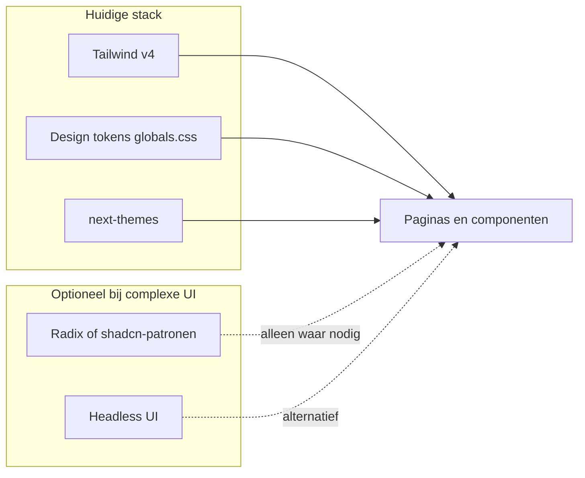

# Wat jullie hebben vs. het artikel

Dit document vat de UI-stylingkeuzes van dit project samen en vergelijkt ze met de categorieën uit het [Builder.io-artikel over React UI-libraries (2026)](https://www.builder.io/blog/react-component-libraries-2026).

## Huidige stack (repo)

| Laag              | Keuze in dit project |
| ----------------- | -------------------- |
| Framework         | Next.js 16, React 19 — zie [package.json](../package.json) |
| Styling           | **Tailwind CSS v4** (`@tailwindcss/postcss`, `@import "tailwindcss"` in [src/app/globals.css](../src/app/globals.css)) |
| Thema             | **next-themes** + `@custom-variant dark` + eigen tokens (`--renovation-*`, `--background`, accent cyan/teal) |
| Component library | **Geen** — geen `@radix-ui/*`, geen shadcn, MUI, Chakra, Headless UI, DaisyUI in dependencies |
| Patroon           | **Utility-first Tailwind** op maatgebouwde componenten (bijv. [LoginForm.tsx](../src/components/auth/LoginForm.tsx)) |

Kort: dit project volgt het pad dat het artikel beschrijft als **Tailwind-project met volledige visuele controle**, vergelijkbaar met een eigen design system bovenop utilities — niet als kant-en-klare design system library (MUI, Ant, Chakra).

## Hoe dit zich verhoudt tot het artikel

Het artikel onderscheidt onder andere:

- **Volledige design systems** (MUI, Ant Design, Chakra): snel veel componenten, duidelijke “look”, maar zwaarder en lastiger om exact de huidige Cosmos/cyan-token-layout te laten matchen.
- **Tailwind-vriendelijk**: o.a. **shadcn/ui** (Radix + Tailwind, copy-paste), **Headless UI** (gedrag zonder stijl), **DaisyUI** (semantische classes zoals `btn`).
- **Headless / primitives** (Radix, React Aria, Base UI): geen vaste look — ideaal als je al tokens en utilities hebt zoals in [globals.css](../src/app/globals.css).

In deze codebase zit je nu bij **headless + maatwerk**: zelf tokens en layout, geen externe “skin”.

## Wat het beste past bij dit project en deze layout

**Primair advies: niet switchen naar een groot design system** (MUI/Chakra/Ant) tenzij je bereid bent om de hele visuele taal te heralignen. Er is al een samenhangend palet (neutraal, cyan-accent, grid-pattern) en dark mode — dat is het scenario waarin het artikel **headless** of **Tailwind + eigen componenten** aanbeveelt boven een opinionated library.

**Aanbevolen richting:**

1. **Blijven op Tailwind v4 + bestaande tokens** als basis voor alle schermen en layout — minste migratie, consistent met wat er al staat.
2. **Optioneel later**: waar complexe UX nodig is (modals, dropdowns, focus-trap, WAI-ARIA), **Radix-primitives** of **shadcn/ui-achtige patronen** — die style je met dezelfde `renovation-*` / `@theme` kleuren, dus de layout blijft het eigen merk.
3. **Headless UI** is een logisch alternatief voor hetzelfde doel als je vooral Tailwind-native wilt blijven en de Tailwind-team-integratie waardeert; **DaisyUI** past minder natuurlijk als je al op utilities + semantische CSS-variabelen bent ingericht (dubbele abstractielaag).

**Conclusie:** Wat je **hebt** past bij het artikel als **Tailwind + custom design tokens + (eventueel) headless voor moeilijke interacties**. Wat **het beste past** is **geen grote library-switch**, maar **uitbreiden waar nodig** met headless building blocks die de bestaande [globals.css](../src/app/globals.css)-layout en componentstijl niet overschrijven.

## Referentie

- [15 Best React UI Libraries for 2026 (Builder.io)](https://www.builder.io/blog/react-component-libraries-2026)
